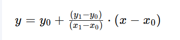

# 综合知识
## 计算题
### 流水线
- 执行时间 = T启动时间 + (n - 1)T周期，T周期为最长的时间段 || (k + n -1)t，k为流水线的深度，n为任务的个数，t为每个阶段的处理时间
- 加速比 = 不使用流水线的时间 / 使用流水线的时间
- 吞吐量 = n / T执，最大吞吐量由流水线中执行时间最长的那个流水段决定

### 可靠度
- 串联系统： R = R1R2
- 并联系统： R = 1 - (1 - R1)(1 - R2)

### 循环冗余码 CRC
1、补充：在原始信息位后补充r个0，r为多项式的最高阶数，得到A
2、取值：取多项式的幂指数，存在取1，否则取0，得到B
3、相除：A/B异或运算，得到C
4、补充：C不足r位置，在前面补0，得到D
5、拼接：将D拼接在原始信息的后面

### 海明码

### cache指令的平均读取时间
T = cache命中率 * cache读取时间 + cache未命中率 * 主存读取时间

### 信息传输速率
总信息传输速率 = 平均事务大小*每字节位数*事务个数*平均用户数 / 平均会话时长

### 数据包传输时间
发送到接受完成的时间 = 发送时间 + 传播时延（电信号在电缆中的传播速度是200m/ns）

时间的换算：ns、us、ms、s

### 求子网掩码
根据要划分的子网数量，决定主机号需要借给网络号多少位，子网掩码：网络号全为1，主机号全为0

### 位示图磁盘计算
单位换算：1字节=8位 1字=2的n次方字节（n取决于系统位数，32位一个字节是4位还是64位一个字节是8位）

位示图的大小 = 磁盘物理块个数 / 系统字节位数

## 计算机系统基础
### 信息属性

### 指令系统

- RISC：精简、数量少、固定长度、寻址方式少、硬布线逻辑控制、支持高级语言
- CISC：复杂、数量多、可变长度、寻址方式多、微程序控制 、研发周期长

### 计算机应用
#### 多媒体通信技术标准
- H.320：面向窄带综合业务数字网
- H.323：基于包交换网络的音视频通信系统标准
- H.324：低速率网络
- H.264：视频压缩编码技术，音视频压缩国家标准 AVS

#### 蓝光盘
波长405mm，单层数据容量达到25GB

#### 媒体分类
- 感觉媒体：直接作用于人的感觉器官，如引起视觉的图像、触觉反馈设备、音乐
- 表示媒体：传输感觉媒体的中间媒介，如图像编码（条形码、二维码）、图表、文本
- 表现媒体：进行信息输入输出的媒体，如显示器
- 存储媒体：储存表示媒体的物理介质，如光盘
- 传输媒体：传输表示媒体的物理介质，如光缆

#### PCM 声音信号数字化
定义：将模拟信号转为数字信号的技术

- 采样：将连续的模拟信号转成信号，采样频率必须至少是信号最高频率的两倍，以避免失真
- 量化：信号幅度转换成有限数量的离散值，量化的精度由量化级别决定
- 编码：将量化后的信号样本转换为二进制代码，为方便计算机存储、处理和传输，进行数据压缩和编码

#### MPEG 动态图像专家组
为CD建立视频和音频压缩标准的组织

- MPEG-4：面向低传输速率下的影音编码标准，广泛应用于网络流媒体、移动视频通信、视频会议
- MPEG-7：定义了描述多媒体内容的元数据标准，支持多媒体检索、索引和过滤
- MPEG-21：面向数字内容交互的标准

#### 图像
- 真彩图：采用RGB三个基本色，值决定基准色的强度
- 伪彩色：查找映射的方法，像素值实际上是一个索引值
- 直接色：分为红、绿、蓝三个分量作为单独的索引值进行变换

### 计算机系统结构分类

Flynn分类：指令流、数据流

- SISD：单指令流单数据流，单处理器计算机
- SIMD：单指令流多数据流，并行处理机、超级向量、GPU图形处理单元、DSP数字信号处理器
- MISD：多指令流单数据流，现实不存在
- MIMD：多指令流多数据流，当代计算机，适用于高性能计算、服务器和多核处理器系统

#### 多处理器系统架构
- SMP 对称多处理：共享物理内存，没有主从关系，适用于较小规模系统，高交互性和频繁数据共享的应用，OLTP 在线事务处理系统，如数据库
- NUMA 非一致性内存访问：独立内存，适用于大规模系统，处理大量数据且访问速度要求高，OLAP 在线分析处理，如数据仓库
- MPP 大规模并行处理：由多个独立节点组成，通过高速网络互联，无共享结构，适用于大规模科学计算和数据分析，HPC 高性能计算应用

## 操作系统
### 存储管理
#### 页式存储
- 划分固定大小的块，简化了内存管理
- 虚拟空间划分为同样大小的页，减少了内存碎片
- 进程的虚拟页通过页表映射到物理页，支持虚拟内存
- 可能产生内部碎片，不完全填满的页会造成空间浪费

地址转换：页号 + 页偏移量，访问虚拟地址，查找页表将虚拟页号转换为物理页号，再结合页偏移量得到最终的物理地址

淘汰页面原则：状态位0表示不在内存无需考虑，访问位1说明CPU刚刚访问过不能淘汰
#### 段式存储
- 按逻辑功能划分不同的块，长度不固定
- 独立加载到内存中，支持信息共享和保护，支持动态加载和动态链接
- 可能产生外部碎片，分配和释放时可能会留下无法利用的小空间

地址转换：段号 + 段偏移量，段表用于将逻辑段号映射到内存中的物理段
#### 段页式存储
地址转换：

- 段到页：根据段号查找段表，获取段的基址和长度
- 页内偏移：页内偏移量直接用于确定页内的位置
- 页到物理地址：使用段基址和页内偏移量，结合页表中的映射信息，找到对应的物理页号，将物理页号和页内偏移量组合，形成最终的物理地址

### 进程管理
#### 进程与线程
- 资源拥有：进程拥有独立的资源，而线程共享进程的资源
- 地址空间：进程拥有独立的地址空间，线程共享进程的地址空间
- 创建开销：创建进程的开销大于创建线程的开销
- 通信方式：进程间通信需要特定的机制，而线程间可以直接读写共享变量
- 独立性：进程是独立运行的互不影响，同一进程下的一个线程崩溃可能会影响到其他线程

#### PV操作与信号量
信号量是用于进程同步和互斥的一种机制，大于0表示当前有可用资源可继续操作，小于0表示被阻塞，资源需等待

PV操作：通过P操作和V操作来改变信号量的值，通常结合前趋图

- P操作：减1，用一个指向信号量的箭头表示，表示获得或请求一个信号
- V操作：加1，用一个从信号量出发的箭头表示，表示释放或发送一个信号

#### 死锁
多个进程在执行过程中，因争夺资源而造成的一种僵局，不发生死锁的最小资源数 = n进程 * （R资源 - 1） + 1
 
- 特点：互斥、占用和等待、不可剥夺、循环等待
- 原因：资源竞争、进程推进顺序不当、资源分配策略不当
- 解决：银行家算法、死锁检测、资源剥夺、进程撤销

#### 银行家算法

- 求出各进程剩余需求量 = 资源总数-已分配数（总和）
- 根据剩余需求量，找到可以立即满足的进程
- 运行结束时释放所占有的资源
- 重复第二步操作

### I/O设备管理软件
自底向上：硬件、中断处理程序、设备驱动程序、设备无关程序、用户进程

步骤：I/O请求自上向下，应答自下向上

### 嵌入式
- 微型化
- 可定制：可运行在不同的平台上，针对硬件变化进行结构和功能上的配置
- 实时性
- 可靠性
- 易移植性：采用硬件抽象层和板级支撑包的底层设计技术

## 数据库
- 元组：一条数据库记录
- 分量：元组中的某一个属性值

### 数据库模式 

#### 集中式数据库 
##### 体系结构-三级模式和两级映射
- 外模式：视图级，用户模式
- 模式：表级，概念模式
  - 外模式-概念模式映射：逻辑独立性
  - 概念模式-内模式映射：物理独立性
- 内模式：文件级，物理模式

#### 分布式数据库
##### 特点
- 分布式：数据放在不同的物理节点上
- 自治性：不同的物理节点有自己的局部DBMS
- 可用性：由于多副本机制，某个节点发生故障，其他节点仍然可用

##### 分片方式
- 水平分片：按元组分片
- 垂直分片：按属性列分片
- 混合分片

### 关系模式

R（U，F）：U 表示属性集合，F 表示各属性的依赖关系
#### 闭包

由一个属性直接或间接推导出的所有属性的集合

1、设 X 为待求闭包 AB 的集合{A，B}
2、依次从依赖关系出发，若函数依赖左侧的属性都在 X 中，且右侧的属性不在 X 中，将属性放入 X
3、重复 2 直到没有属性可以添加到 X 中，最后的 X 就是闭包
#### 候选键
唯一标识每一行数据的最小集合

1、从函数依赖出发，将所有属性分成 3 类：L 类（全部出现在依赖关系左侧的属性）、R 类、LR 类
2、可能成为候选键的有 L 类和 LR 类
3、求出他们的闭包，若包含所有属性，则说明其为候选键

#### 关系实例推出依赖集
- 寻找决定因素
- 记录依赖关系
- 最小化函数依赖集
- 考虑传递依赖
### 关系代数
并、交、差、笛卡尔积x、投影Π（筛选属性列）、选择（筛选符合条件的行）、自然连接（列数 = 两者之和 - 重复列，元组取值相同的）

考点：

- 运算结果判断
- 等价表达式替换
- 性能判断：
  - 自然连接优于笛卡尔积
  - 先做选择，在做连接

### 规范化理论

#### 函数依赖
- 完全函数依赖：依赖决定因素组中，其中任一单个属性都不能单独决定，X 任何一个属性被去掉都不能唯一确定 Y
- 部分函数依赖：依赖决定因素组中，其中任一单个属性都能够单独决定，X 的某些属性去掉依旧可以确定唯一 Y
- 传递函数依赖：单向依赖传递，y 依赖 x 但 x 不依赖于 y

#### 键
- 候选键：唯一标识元组，所有属性组成候选键为全码
- 主键：从候选键中选一个充当主键
- 外键：充当其他关键模式主键的属性
- 属性：构成候选键属性集的某一个属性为主属性，不包含在候选键的属性为非主属性

#### 范式
- 第一范式：强调原子性，属性不可分，不重复
- 第二范式：所有非主属性都完全依赖于候选键，不包括部分依赖
- 第三范式：非主属性直接依赖于候选键，不包括传递依赖
- BCNF：函数依赖关系中左侧的决定因素必须要包含某个候选键

考点：各个范式的判断、范式如何拆解进行转换

#### 模式分解

##### 保持函数依赖分解
- 函数传递依赖可以推出函数依赖
- 分解的函数依赖需要包括所有的原依赖
##### 无损分解
关系模式分解后，可以通过关系代数运算还原到原来的关系模式

公式：R1∩R2 -> (R1-R2)或者(R2-R1)

### 数据库管理
#### 并发控制
##### 事务四大特性
- 原子性：全成功或全失败，作为一个整体
- 一致性
- 隔离性：事务执行不能被其他事务干扰
- 持久性：改变是永久的
##### 封锁协议
- 排它锁：X锁，写锁，若加上了X锁，其他事务不能加任何锁
- 共享锁：S锁，读锁，若加上了S锁，其他事务只能加S锁不能加X锁
- 一级封锁协议：预防丢失修改
- 二级封锁协议：在一级的基础上，可以预防读取脏数据
- 三级封锁协议：在二级额基础上，可以防止数据重复读取

#### 完整性控制
- 实体完整性约束：主键唯一且非空
- 参照完整性约束：外键作为其他关系的主键或者为空
- 用户自定义完整性约束
- 触发器：实现复杂完整性约束

#### 故障恢复
故障：事务内部故障、系统故障、介质故障、计算机病毒

数据备份方式：

- 冷备份：静态备份，数据库正常关闭，在停用的状态下，备份数据
- 热备份：动态备份，运行状态备份数据

数据备份分类：

- 全量备份：备份所有数据
- 差量备份：备份上一次全量备份之后变化的内容
- 增量备份：备份上一次备份之后变化的内容

## 计算机网络
### 数据通信
#### 信道
  - 物理信道（有/无线）、逻辑信道（有/无连接）
  - 通信方式：单工、半双工、全双工
  - 复用技术：频分FDM、时分TDM、码分CDM
#### 数据传输技术
并行、串行、同步、异步
##### 数据编码和调制
- 模拟信号：连续变化的信号，传输语音
- 数字信号：离散信号，传输数字

### 网络体系结构和协议
- 结构：OSI七层模型、TCP/IP4层模型、5层模型
- 协议
  - 应用层
    - HTTP超文本传输协议 80
    - HTTPS加密传输协议 443
    - FTP文件传输协议 21
    - Telnet远程登录协议 23
    - SMTP邮件传输协议，发送电子邮件 25
    - POP3从服务器下载邮件，接收电子邮件 110
    - IMAP4互联网消息访问协议，在POP3的基础上增加删除，标记邮件 143
    - DNS域名解析协议，将域名转成IP地址 53
    - DHCP动态主机配置协议 68
    - SNMP简单网络管理协议 161
  - 传输层：TCP、UDP无连接不可靠
  - 网络层：ARP地址解析协议、ICMP控制报文协议
  - 数据链路层：以太网、PPP点对点协议

### 网络设备
- 物理层：集线器（扩展网络）、中继器（延长网络的传输距离）
- 数据链路层
  - 网桥：连接多个局域网，端口数量少，插网卡
  - 交换机：网桥的扩展，可连接更多的网络段，端口数量多，专门硬件，转发速度快
- 网络层：路由器、3层交换机
- 传输层：负载均衡器（将网络流量分发到多个服务器上）、防火墙
- 应用层：代理服务器、DNS服务器

### 网络地址
#### IPv4
- A类：8+24，最大主机数2^24 - 2
- B类：16+16，最大主机数2^16 - 2
- C类：24+8，最大主机数2^8 - 2
#### ipv6
- 地址长度：128位，8组4位十六进制
- 表示形式：每组4位之间用冒号分隔，0000可以简化为0，0012可以简化为12
- 零压缩规则：连续的0可以被压缩成：：，只能使用一次

### 报文
#### IP报文
- 地址信息：包含源IP地址和目的IP地址，用于标识数据包的的发送方和接收方
- 不可靠性：可能丢包、重复和乱序传输
- 分组和重组：适用不同网络的最大传输单元
- 头部信息
#### TCP报文
- 可靠性：确保数据包按顺序、无差错、不重复地传输
- 流量控制：使用窗口机制进行流量控制
- 拥塞控制：动态调整发送速率，以避免网络拥塞
- 连接导向：数据传输前需要建立连接，结束后需要释放连接
- 头部信息

### DNS
#### 解析方式
- 递归查询：客户端向本地DNS服务器发起查询请求
- 迭代查询：DNS服务器之间

#### 查询顺序
浏览器缓存、操作系统缓存、本地host文件、本地DNS服务器、根DNS服务器、顶级域名服务器、权威DNS服务器

### 建筑物综合布线系统
- 工作区子系统：负责将终端设备连接到信息插座
- 水平区子系统：连接楼层分配线设备至信息插座的水平电缆
- 管理子系统：负责计算机设备与各管理子系统间的连接
- 干线子系统：负责连接楼层之间的设备间
- 设备间子系统：负责公共系统间的各种设备连接
- 建筑群子系统/园区子系统：将一个建筑的电缆线延伸至建筑群中的其他建筑

## UML
结构事物：类、接口（提供操作服务）、协作（定义交互操作）、用例、活动类、构件和节点（物理元素）
### 分类
#### 按特点分类
- 结构视图（静态）：类图、对象图、组件图、部署图、包图、组合结构图
- 行为视图（动态）：用例图、状态图、活动图
- 交互视图：序列图、通信图、时间图、协作图、交互概览图
- 实现视图：组件图、部署图

- 行为视图：系统的内部状态和业务逻辑的流转，强调对象或系统的状态变化和行为的发生条件，
当需要描述系统的业务流程、状态转移、或整体行为时使用行为视图，多用于描述单一对象或整个系统的行为

- 交互视图：系统中不同对象之间的消息传递和交互过程，强调参与者之间的通信顺序和依赖关系
#### 按阶段分类

- 需求分析阶段：用例图、活动图
- 概要设计阶段：类图、包图、组件图、状态图
- 详细设计阶段：类图、序列图、协作图、组件图、包图、交互概览图

### 定时图
强调跨越不同对象或参与者的实际时间，而不仅仅是关心消息的相对顺序
### 类图
特点：表示类、接口以及他们之间的静态结构和关系

关系：
- 关联：两者的结构性关系，一对一或者一对多
- 组合：整体与部分的关系，部分不可以离开整体单独存在，实线实心菱形
- 聚合：整体与部分的关系，部分可以离开整体单独存在，实线空心菱形
- 泛化：继承关系，实线空心三角箭头
- 实现：类与接口的关系，虚线空心三角箭头
- 依赖：使用关系，虚线普通三角箭头
### 对象图
特点：显示某一时刻对象实例之间的交互和关系，属于类图的实例化
### 用例图
- 由参与者、用例、边界以及它们之间的关系组成的
- 描述整个系统的功能以及用户如何与系统进行交互
- 关系：
  - 关联关系：参与者与用例之间的关系，实线表示
  - 包含关系 include：用例之间的关系，表示一个用例内包含的子功能，子功能一定会使用到，箭头指向子功能，如想要查询订单前提是需要先登录，查询订单包含登录
  - 扩展关系 extend：用例之间的关系，表示一个用例的扩展功能不一定会使用，箭头指向被扩展用例，如基于查询订单，可以增加导出数据的功能
  - 泛化关系：参与者与用例之间的关系，子用例继承父用例所有的结构、行为和关系
- 用例规约：用例名称、简要说明、事件流、非功能需求、前置条件和后置条件、拓展点、优先级
### 序列图
对象之间随时间变化的交互关系，强调对象之间的关系，包括消息的传递和时间顺序

- 角色：人、系统
- 对象：对象名、类名
- 生命线：从对象图表向下延伸一条虚线，表示对象存在的时间
- 控制焦点：表示在这个时间段内对象执行的操作，用小矩形表示
- 消息：同步（实线实心箭头）、异步（实线普通箭头）、返回消息（虚线普通箭头）

适用场景：流程涉及多个角色或对象，经过这些角色对象展开交互，并且会有信息的传递
### 通信图
描述收发信息的对象的组织结构，强调对象间的合作关系而不是时间顺序
### 状态图
- 由状态、转移、事件和活动组成
  - 状态：起始状态（实心圆）、结束状态（黑点圆）、矩形
  - 迁移：导致状态发生变化的事件，箭头指向变化后的状态
- 关注对象的状态变化，用来描述对象的状态以及时间变化时状态的转移条件
- 适用场景：某一个流程是围绕事物的状态变化的
### 活动图
- 由点、活动、迁移、分支、分叉和会合、泳道组成
  - 点：起始点（实心圆）、结束点（黑点圆）
  - 活动：人或系统的一连串执行细节，矩形表示
  - 迁移：表示流程控制权的迁移
  - 分支：代表一个判断的准则，以菱形块表示
  - 分叉和会合：代表后续活动的同步处理，分叉与会合会搭配出现（可以表示并发执行的过程，流程图只能表示顺序执行的过程）
  - 泳道：利用泳道分配对应的角色，可以帮助我们清晰地知道发起活动的角色是谁
- 描述具体业务用例的行为流程，强调对象间的控制流程
- 适用场景：表达企业或系统的工作流程关系
### 组件图

表示系统中组件提供的、需要的接口和端口等以及它们的关系
### 部署图

描述了系统内部的软件如何分布在不同的节点上，用来表示软件和硬件的映射关系
### 包图

包层面的结构设计，描述包与包之间的依赖关系

- use：依赖关系
- merge：合并关系
- access：私有引用，如代码中指定包名类名
- import：公共引用
### 时序图

随时间变化，一个或多个元素的值或状态的更改

## 企业信息化战略和实施

### 企业战略和信息化战略的集成

#### BITA 业务与 IT 整合

定义：以业务为导向、全面的 IT 管理资讯实施方法论，适用于信息系统不能满足当前管理中的业务需要，业务与 IT 有不一致的地方

步骤：评估和分析当前不一致的领域，整合战略，建立业务模型，提出达到未来目标的转变过程建议和初步计划以及执行计划

#### EITA 企业 IT 架构

定义：分析企业战略，帮助企业制定 IT 战略，帮助企业制定 IT 的原则规范、模式和标准，适用于现有信息系统和 IT 基础架构不一致、不兼容和缺乏统一的整体管理的企业

### 信息系统战略规划方法 ISSP
战略一致性模型：企业经营战略、业务流程与组织、信息系统战略、IT基础架构

#### 步骤

从企业战略出发，构建信息架构，实现战略目标

#### 阶段

- 以数据处理为核心，围绕职能部门需求（企业系统规划法、关键成功因素法和战略集合转化法）
- 以企业内部管理信息系统为核心：（战略数据规划法、信息工程法、战略栅格法）
- 综合考虑内外环境，以集成为核心（价值链分析法、战略一致模型）

### 企业信息化工程 EIE

将信息技术、自动化技术，现代管理技术和制造业技术相结合

### 企业资源计划 ERP
为企业运营提供`辅助决策`和日常管理信息的大规模集成化软件

- 企业资源三流
  - 物流
  - 资金流
  - 信息流
- 以财务为中心
  - 两个任务
    - 计划
    - 执行
  - 三个主线
    - 供应链管理
    - 生产管理
    - 财务管理

#### 发展历程

- MRP 物料需求计划：物料单系统
- MRPII 制造资源计划：增加库存、分销
- ERP 企业资源计划：打通了供应链，把财务、人力资源、资源管理纳入

### 客户关系管理 CRM

定义：管理企业与和当前潜在客户互动的方法，用于在整个客户生命周期内管理和分析客户交互以及数据，即是一套管理制度，也是一套软件和技术

核心：客户价值管理

支柱功能：市场营销和客户服务
#### 与 ERP 的区别

- erp 重点关注企业内部资源计划，crm 关注市场和客户
- erp 强调业务增长提高整个盈利业务的生产力，crm 以客户关系的建立、发展和维护为目标
- erp 偏向于内，crm 偏向于外

### 供应链管理 SCM

定义：执行供应链中从供应商到最终用户的物流的计划和控制等职能。指企业通过改善上、下游供应关系，整合优化三流

- 计划
- 采购
- 制造
- 配送
- 退货

### 商业智能 BI

流程：需求分析、数据仓库建仓、数据抽取、建立 BI 分析表、用户培训和数据模拟测试、系统改进和完善

层次：数据报表、多维数据分析、数据挖掘

数据分析：联机分析处理和数据挖掘

#### 数据仓库

- 数据按主题组织
- 消除数据中的不一致性，提供整个企业的一致性全局信息
- 主要进行查询操作，少量修改和删除
- 反映历史变化

#### 数据挖掘

##### 方法

- 决策树：构建树结构进行分析
- 神经网络：类似统计学的判别、回归、聚类
- 遗传算法：选择、重组、突变
- 关联规则挖掘算法：描述数据之间存在的规则

##### 分类

- 关联分析：挖掘出隐藏在数据间的相互关系
- 序列模式分析：侧重于分析数据的因果关系
- 分类分析：先赋予标记再分类
- 聚类分析：根据已有特征，将相同的放在一类

#### OLAP 和 OLTP

- OLAP：联机分析处理，对应数据仓库
- OLTP：联机事务处理，对应数据库

### 企业应用集成 EAI
消除信息孤岛，将多个企业信息系统联系起来，首先需要解决数据和数据库的集成问题

- 表示集成
- 数据集成
- 控制集成
- 业务集成

### 产品数据管理 PDM
管理所有的产品相关信息和过程，帮助企业实现对与企业产品相关的数据、开发过程以及使用者进行集成与管理

#### 知识管理工具
- 知识生成工具：知识获取、合成、创新
- 知识编码工具：将知识有效的存储并呈现给使用者
- 知识转移工具：在企业内传播和分享

### 业务流程重组 BPR
- 对企业的业务流程进行根本性的再思考和彻底性的再设计，以业务流程为中心
- 以关心客户的需求和满意度为目标，以客户为导向
- 以人为本的原则

### 业务流程管理 BPM
根据现有流程的具体情况，对流程进行规范化的设计流程管理包含三个层面：规范流程、优化流程和再造流程，并不要求对所有的流程进行再造

#### 3要素
- 实体
- 对象
- 活动

#### 方法
- 标杆瞄准：连续、系统化地对外部领先企业进行评价的过程
- IDEF：一系列建模、分析和仿真方法的通称，可同时表达系统的活动和数据流，擅长表达业务流程的阶梯结构特征
- DEMO：定义了行为角色之间的通信方式，适合表达多角色之间事务的因果和条件关系
- Petri网：图形化语言，擅长描述具有并行、异步、分布式和随机性的信息系统

### 电子数据交换 EDI

- EDI 软硬件
- 通信网络
- 数据标准化

### OSI 安全体系方案

- 主动攻击：攻击信息来源的真实性、完整性、可用性，例如：截获修改、重放、伪装、服务拒绝、陷门
- 被动攻击：对信息的保密性进行攻击，不修改信息的内容，例如：窃听、业务流分析、电磁

### 电子政务

- G2G：上下级、不同地区、不同职能部门之间实现的电子政务活动，如信息采集
- G2B：向企业提供公共服务，如营业执照
- G2C：向公众提供服务，如户口、证件办理
- B2G：企业纳税

## 信息化

### 阶段

- 第一阶段：以数据处理为核心，围绕职能部门需求，包括方法：BSP方法、关键成功因素法CSF、战略集合转化法
- 第二阶段：以企业内部管理信息系统为核心，围绕企业整体需求，包括方法：IE方法、战略系统规划法SSP
- 第三阶段：综合考虑企业内外环境，以集成为核心，围绕企业战略需求，包括方法：价值链分析法VCA、战略一致模型SAM

### 企业建模
- 输入：年终报告、组织层次图、业务计划和备忘录
- 输出：企业任务说明、组织单元目标和关键成功因素表、组织单元目标矩阵

建模方法：
- 形式化的建模方法学：结构化建模方法学、面向对象建模方法学
- 非形式化的建模方法学

### 企业信息系统三要素

- 企业的信息
- 企业的业务过程
- 企业的信息技术

### 企业信息系统四阶段
- 信息规划
- 业务分析
- 系统设计
- 系统构建

### 功能分解原则
- 每个功能至少可分解成两个子功能
- 同一层次成分属于相同类型，同为功能或同为过程
- 同种功能或过程在分解中不能重复出现
- 组成高层次的子功能必须反映较高层功能的所有方面

### 遗产系统的演化策略
- 淘汰策略：技术含量低，商业价值低
- 继承策略：技术含量低，较高的商业价值
- 改造策略：技术含量高，商业价值低
- 集成策略：技术含量高，商业价值高

### 企业门户
- 企业网站
- 企业信息门户
- 企业知识门户
- 企业应用门户

### 信息属性
- 真伪性：中心价值
- 滞后性：数据加工的结果，信息必然落后于数据
- 时效性
- 共享性
- 扩压性

### 数据中台核心能力
- 数据汇聚整合
- 数据提纯加工
- 数据服务可视化
- 数据价值变现

## 软件工程

### 软件测试
- 方法层次测试，单元测试
  - 白盒测试
  - 等价类划分
  - 边界值分析
  - 组合功能测试
  - 递归函数测试
  - 多态消息测试
- 类层次测试，集成测试
  - 接口测试
  - 模拟对象
  - 契约测试
  - 不变式边界测试
  - 模拟类测试
  - 非模拟类测试

### 面向服务的开发方法
- 操作：位于最底层，代表单个逻辑单元的事物
- 服务：：第二层，有特定的结构化接口，并返回结构化响应
- 业务流程：最高层

### 设计模式
- 创建型：创建对象
- 结构型：处理类和对象的组合，Flyweight享元共享技术支持大量细颗粒度的对象和Proxy代理，Decoration装饰模式，动态的给对象增加功能
- 行为型：类和对象的交互以及职责，Visitor访问者把数据结构和和作用于结构上的操作进行解耦

### 模型驱动体系结构
- 计算无关模型：系统的结构和行为，不考虑具体的执行平台
- 平台无关模型：确定系统的实现细节
- 平台相关模型：系统的实现细节

### 逆向工程
- 重构：同一抽象级别上转换系统描述形式
- 设计恢复：借助工具从已有程序中抽象出有关数据设计、总体结构设计和过程设计等方面的信息
- 再工程：在获取信息的基础上，修改重构已有系统，产生一个新版本
- 正向工程：从现有系统中恢复设计信息，使用该系统去改变或重构现有系统

### 工作流参考模型 WRM
工作流执行服务、工作流引擎、流程定义工具、客户端应用、调用应用和管理监控工具

### 模块四要素

- 输入输出：外部特征
- 处理功能：外部特征
- 内部数据
- 程序代码

### 软件开发方法

- 形式化方法：净室软件工程，使用盒结构规约进行分析和建模，将正确性验证作为排错的主要机制 

### 软件开发模型
- 瀑布模型：需求完全确定为前提，线性顺序的阶段性任务
- 迭代模型：重复周期性的迭代，每次迭代都会产生一个可执行的软件版本，逐渐增加新功能或改进现有功能，适合于需求不完全明确或需要逐步探索的复杂项目
- 螺旋模型：将瀑布模型和快速原型模型结合起来，结合了迭代开发和风险分析，每次迭代都包括风险评估，依次为计划指定、风险分析、工程实施和客户评估
- 敏捷开发模型：灵活、快速响应变化，强调团队合作和持续交付，最小化文档工作，适合于需求变化频繁、需要快速响应市场变化的项目
- 增量模型：将软件分解为多个增量组件，逐步开发和集成，每个增量组件完成后都会进行测试，适合于大型软件项目，可以逐步交付和部署软件的不同功能
- 变换模型：以形式化为基础
- 事件驱动模型：适用于那些需求不明确或频繁变化的项目，开发过程由外部事件触发

### 敏捷开发方法
- XP 极限编程：初期无需过多的文档，提倡先行，基本设计后开发一系列用于检测本次发布的单元测试
- FDD 特性驱动开发：针对中小型项目，强调简化实用易接受
- ASD 自适应软件开发：强调适应性
- DSDM 动态系统开发：以业务为核心，快速而有效进行系统开发

### 原型

- 是否实现功能
  - 水平原型：行为模型，探索预期系统的特定行为，达到细化需求的目的，功能导航，用在界面上
  - 垂直原型：结构化模型，实现了部分功能，用在复杂算法实现上
- 最终结果划分
  - 抛弃式原型：探索式原型，达到目标后就抛弃原型，用于需求不确定式，二义性
  - 演化式模型：为开发增量式产品提供基础，用于易于升级和优化的场合，适用于Web项目

### IDEF 集成定义方法
- IDEF0：对业务流程进行建模
- IDEF1：对信息进行建模
- IDEF4：对面向对象设计进行建模

### 软件生存周期
- 获取过程：为获取系统、产品、软件服务的组织而定义的方法，有启动、招标准备、合同编写、对供方监督、验收和完成、合同结束
- 供应过程：向需求方提供活动
- 开发过程：
- 运作过程：在规定环境为用户提供运行计算机服务的组织定义的活动
- 维护过程：

### 软件质量
- 软件需求：是测试软件质量的基础
- 开发标准：定义了一组用于指导软件开发方式的准则
- 隐式需求：间接定义了用户的期望

### 软件需求层次
- 业务需求：组织机构、客户、产品高层次的目标要求
- 用户需求：用户使用产品要完成的任务
- 功能需求：开发人员要实现的功能

### 详细调查
开调查会：有效获取用户对系统的想法和建议

- 书面调查：系统复杂，调查范围宽
- 抽样调查：需要全面资料又无法全面调查
- 现场观摩：系统流程、操作复杂
- 阅读历史文档：数据流复杂，工作表单多

### 云计算体系结构

- 资源层：云计算服务，提供虚拟化的资源，从而隐藏物理资源的复杂性
- 平台层：为用户提供对资源层的封装，使用户构建自己的应用
- 应用层：提供软件服务
- 用户访问层：支持用户使用云计算，提供相应的接口访问
- 管理层：

## 安全性分析与设计
### 信息安全
#### 系统安全分类
- 实体安全：保护计算机设备免受环境事故破坏，包括环境安全、设备安全和媒体安全
- 运行安全：保证系统正常运行，涉及系统风险管理、审计跟踪、备份和恢复、应急等方面
- 信息安全：确保数据的保密性、完整性、可用性和可控性，包括操作系统安全、数据库安全、网络安全、病毒防护等
- 人员安全：涉及用户的安全意识和技能，包括计算机使用人员的安全意识、法律意识和安全技能
#### 信息系统安全分类
物理安全（机房安全）、网络安全（入侵检测）、系统安全（漏洞补丁）和应用安全（数据库安全）
#### 数字证书 CA
基于非对称加密的技术，用于验证数据的真实性和发送者的身份，密钥不包含在证书中，只能被用户拥有。机构的签名用于防止证书的伪造
- 身份认证：利用CA公钥验证证书的真伪，利用对方的公钥验证信息的真伪性
- 数据完整性：确保数据在传输过程中未被篡改
- 不可否认性：发送者无法否认自己签名过的内容，发送者的密钥信息作为防止发送者抵赖的证据

双方互连必要条件：
- 用户在认证机构取得各自能认证自身身份的数字证书，同一机构的数字证书可以通过公钥彼此确认
- 双方使用的证书不同时，要先确定彼此证书机构的可信度
- 需要交换两个CA证书的公钥以确定CA的合法性，然后再进行身份认证

常见数字签名算法：RSA、DSA、ECDSA
#### 哈希/杂凑算法
将任意长度的数据映射为固定长度的散列值（哈希值）的算法
- 定长输出：无论输入数据长度是多少，杂凑值长度固定
- 不可逆性：无法从杂凑值还原出原始数据
- 抗碰撞性：不同的数据产生相同杂凑值的概率极低

常见哈希算法：MD5、SHA-1/2/3、SHA-256
#### 密钥管理体制
涉及密钥的产生、存储、备份/恢复、装入、分配
#### 摘要算法 
确保数据完整性，若数据被修改，只要对比两次摘要

- MD5
- SHA-1：160固定长度摘要
- HMAC
- SHA-256：报文摘要算法
#### 加密算法
- DES：共享密钥，密钥长度为56，3DES进行了3次加密，密钥长度为112，第一次和第三次相同密钥
- RC4：对明文进行加密
- RSA：非对称加密，效率低
- IDEA：对称加密
- AES：高级加密算法
#### 密钥交换算法
- Diffie-Hellman

### 网络安全
#### 防火墙
类型
- 包过滤防火墙：工作在网络层，过滤流量，效率高，缺点是不检查数据包的内容，难以检测复杂攻击
- 状态检测防火墙：工作在传输层，记录连接状态，缺点是处理速度慢，占用更多资源
- 代理防火墙：工作在应用层，内部信息隐藏，安全性相对高，效率低，截获并验证流量然后转发或阻止访问请求，缺点是影响网络性能
- 下一代防火墙：具有应用识别、深度数据包检测（DPI）、内容过滤等功能

部署方式
- 边界防火墙：部署在内外网之间，负责拦截外部攻击，保护内部网络
- 内部分段防火墙：用于不同子网之间的隔离，以增强内部网络的安全性
- 主机防火墙：直接部署在主机上，对主机出入流量进行控制（如Windows防火墙）

工作层次：工作层次越低，工作效率越高，安全性越低，相反反之

DMZ区域：又叫隔离区，常用来放置对外提供的网络服务设备
#### 虚拟专用网 VPN
在公用网络上建立一条“加密隧道”，使得数据在传输过程中保持机密性、完整性和真实性
- 加密：对数据进行加密传输，防止数据被窃听或篡改
- 隧道技术：将原本不安全的公用网络隧道化
- 身份验证：确保连接双方的身份真实可靠

核心协议：PPTP、L2TP/IPSec、SSL/TLS、OpenVPN、WireGuard
#### 安全协议
- PKI：公钥基础设施，为网络应用提供密钥和证书管理体系
- SET：安全电子交易协议，保证网络交易的安全
- Kerberos：网络认证协议，通过密钥系统为C/S应用程序提供认证服务
- SSL/TLS和HTTPS：常用于Web通信、数据加密
- IPSec：用于VPN、站点到站点加密传输，属于网络层
  - 认证头 AH：用于数据完整性认证和数据源认证，不提供数据加密服务
  - 封装安全负荷 ESP：提供数据保密性和完整性认证
  - Internet密钥交换协议：用于生成和分发ESP和AH中使用的密钥
  - 传输模式中，IP头没有加密，只对IP数据进行加密，在隧道模式中对IP数据报进行封装和加密，加上新的IP头
- SSH：用于安全的远程登录、文件传输
- S/MIME和PGP：用于电子邮件加密和签名，属于应用层
- WPA2/WPA3：用于保护Wi-Fi通信，新增临时密钥完整性协议
#### 钓鱼网站
- 仿冒真实网站URL地址
- 通过E-mail传播网站
- 窃取用户账号、密码等机密信息
#### 网络攻击
- XSS跨站脚本攻击：将攻击代码注入用户浏览的网页，包含HTML和JS脚本
- CSRF跨站请求伪造：通过一些技术手段欺骗用户的浏览器去访问一个认证过的网站并执行一些操作，伪装真正的用户去操作
- DoS拒绝服务攻击：估计攻击网络协议实现的缺陷或者耗尽攻击对象的资源，目的是让目标计算机无法正常提供服务
- 缓冲区溢出攻击
- SQL注入攻击：最好的措施是部署WEB防火墙
#### 入侵检测系统
- 事件产生器
- 事件分析器
  - 模式匹配：将收集到的信息与已知的网络入侵数据库对比
  - 统计分析：给系统对象建立特征文件，将特征值进行对比，判断是否超出正常范围
  - 数据完整性分析：观察系统对象属性是否被修改，常用于审计分析
- 事件数据库
- 响应单元
#### 计算机病毒木马
- 文件型：感染可执行文件
- 引导型：影响软盘或硬盘的引导扇区
- 宏病毒：感染使用某些程序创建的文本文档、数据库、电子表格等
- 目录型：修改磁盘上存储的所有文件的地址
#### Web服务技术体制 
- WS-CDL：描述Web服务之间交互的规范，定义了服务如何相互协作以完成业务流程，关注的是服务之间的消息交换模式，而不涉及单个服务的内部行为
- WS-BPEL：定义和执行业务流程的规范，是实现服务组合的事实标准，将多个Web服务组合成一个复合服务或业务流程，关注于业务流程的控制逻辑和执行顺序
- WS-Security：供了一套安全机制，用于保护Web服务通信的安全性和完整性，包括对SOAP消息的加密、签名和认证
- WS-Orchestration：关于Web服务编排的规范，通过一个中心控制点来协调多个Web服务的执行
- WS-Choreography：定义了服务如何相互协作而不需要一个中心控制点
#### 安全审计
- 检查和制止对系统的入侵
- 发现计算机的滥用情况
- 对潜在攻击者起到震慑的作用
- 为系统管理员提供运行日志
- 发现系统入侵行为和潜在漏洞

## 知识产权
- 知识产权属于民法
- 中国版权保护中心为软件著作权登记机构
### 计算机程序的法律保护形式
- 著作法：保护计算机程序及开发文档，无须经过个别确认，自开发完成自动取得软件著作权，延期至作者去世后的50年
  - 法律、法规、国家机关决议、决定和其他行政文件，不给予著作权
  - 时事新闻，人们享有知情权，不给予著作权
  - 历法、表格、公式，属于人类共同的财富，不给予著作权
  - 开发软件所用思想、处理过程、操作方法等，不给予著作权
- 专利法：智力活动的规则和方法不能作为专利法，有期限，受国家地区的限制
- 商标法：可以延长保护期限，申请在先原则，相同则抽签
- 商业秘密法：不被公众所知晓，能给权利人带来经济利益，具有实用性并收到权利人采取保密措施的技术信息和经营信息

### 著作权
- 原创性：软件应该式开发者独立设计、独立编制的编码组合
- 感知性：受保护的软件须固定在某种有形物体上
- 可再现性：把软件转载在有形物体上的可能性

### 许可权
- 独占使用许可：只有被许可人可以使用软件
- 排他使用许可：不得再向第三人发放该软件的使用许可，著作人仍可以使用
- 普通使用许可：除了享有自己使用的权力外，并不享有任何排他权力

### 合同法
未约定软件的使用权、转让权以及利益分配方法的情况下，应当认为软件的知识产权属于软件开发者

## 系统生命周期

### 系统规划
目标：对企业的环境、目标以及系统的状态做一个初步的调查，对建设新系统的需求做出分析和预测

产出：系统设计任务书

### 系统分析
产物：系统方案建议书

### 系统设计
产物：系统设计规格说明书 

### 系统编码
产物：程序规格说明

### 系统测试
产物：操作手册

# 案例分析
## 范围
- 系统规划：可行性分析、遗留系统的处理策略、成本收益
- 需求分析：需求获取方法、需求评审、面向对象分析、结构化分析
- 系统分析：业务流程分析、系统可靠性分析
- 系统设计：结构化建模技术（数据流图）、面向对象建模技术（UML概念、特点、适用场景）
- 数据库建模：E-R模型、规范化、反规范化、并发控制和死锁、数据同步
- 项目管理：进度、范围、成本、质量、风险管理
- 其他
## 系统规划
### 可行性分析
- 经济可行性：主要评估项目的建设成本、运行成本和项目建成之后可能的经济收益
- 技术可行性：评估信息系统需要实现的功能和性能，以及技术能力约束
- 法律可行性：评估项目是否符合相关法律法规
- 运营可行性：评估项目实施后的运营效率和可维护性
- 时间可行性：评估项目是否能在预定的时间内完成
- 用户使用可行性：从使用该系统的用户角度评估系统的可行性

### 成本收益
#### 投资回收期
定义：用该系统产生的净现金收入回收初始全部投资所需要的时间，也就是回本时间

- 静态投资回收期=累计净现金流量出现正值的年份-1+|上一年累计净现金流量（总）|/当年净现金流量
- 动态投资回收期=累计折现值出现正值的年份-1+|上一年累计折现值|/当年折现值
- 投资收益率=投资收益/投资成本*100%
## 需求工程
### 需求获取的方法
- 用户访谈：一对一直接与用户进行对话
  - 适用于获取详细和深入的需求信息
  - 访谈对象是关键利益相关者或领域专家，需要领域知识支撑，成本较高
- 联合需求计划 JRP：与高度组织的群体（开发团队）一起讨论，共同组成专题讨论组来分析，快速迭代与用户紧密参与的项目
  - 发挥用户和管理人员参与系统开发的积极性，提高开发效率
  - 降低系统需求获取的时间，加速系统的开发周期
  - 通过原型对系统需求进行确认，具有原型化开发方法的优点
- 采样：基于数理统计，选取特定的用户群体分析他们的行为或需求，
  - 适用于文档的数据庞大，无法一一研究时
  - 提高收集的效率，减少数据收集的偏差
  - 样本数量=0.25*（可信度因子/错误率）2次方
- 问卷调查：快速收集广泛群众的基本需求
  - 适用于初步了解广泛用户群体的基本需求
  - 覆盖样本量大，成本较低
  - 只能获取有限的、表面的信息
- 阅读历史文档：有成熟的文档，适用于需要对系统进行升级或替换（已有系统）
- 现场观摩：直接观察用户在使用产品或服务的过程中的行为、反应和问题，理解用户行为和工作流程（已有系统）
  - 有助于发现用户未明确表达但实际存在的需求
  - 需要较长的时间和较高的成本

### 需求评审
#### 内容
- 正确描述预期的、满足项目干系人需求的系统行为和特征
- 需求是从系统需求、业务规格和其他来源中正确推导而来的
- 需求是完整和高质量的
- 需求的表示在所有地方都是一致的
- 需求为后续系统设计、实现和测试提供基础
- 用例优先级合理度评估
#### 作用
- 发现二义性需求
- 发现遗漏需求
- 降低风险
- 提高软件质量
- 统一团队成员理解

### 需求分析
- 绘制系统上下文范围关系图
- 创建用户界面原型
- 分析需求的可行性
- 确定需求的优先级
- 为需求建立模型
- 创建数据字典
- 使用QFD质量功能部署
## 系统分析
### 面向对象分析
基于对象和类的概念，强调实体的属性和行为以及他们之间的联系，高内聚低耦合的特点，支持复用
### 结构化分析
基于功能的分层和分解，将系统功能分解到各个功能模块，描述细分模块来达到描述整个系统的目的，
强调系统的输入、处理和输出，侧重于系统的处理逻辑

UML：功能模型（数据流图DFD）、数据模型（实体-关系图E-R）、行为模型（状态转换图STD）、数据字典

#### 数据流图
- 理解和表达用户需求的工具，是需求分析的手段
- 概括的描述了系统内部逻辑过程，是需求分析结果的表达工具，是系统设计的起点
- 作为存档的文字材料，是进一步修改和充实开发计划的依据
#### 数据字典
可以确保数据在系统中的完整性和一致性
- 按各种要求列表
- 相互参照，便于系统修改
- 由描述内容检索名称
- 一致性校验和完整性校验

类目：
- 数据项：又称数据元素，是系统中最基本的数据组成单元，不可再分的数据单位
- 数据结构：描述数据项之间的关系
- 数据流：由一个或一组固定的数据项组成
- 数据存储：描述数据的存储结构，不涉及物理组织
- 处理过程：仅对最底层的处理逻辑加以说明
- 外部实体：数据的来源和去向
### fast开发方法
- 初始研究阶段：进行市场调研，确定项目的目标和范围，评估项目的可行性
- 问题分析阶段：分析现有系统的问题和改进项，确定系统的需求和目标
- 需求分析阶段：详细定义系统的功能需求，制定需求规格说明书
- 决策分析阶段：评估不同方案的可行性，选择最佳的实施方案
### 面向对象系统开发
- 实体对象：用来表示业务域中的事实数据并需要持久化存储的对象类型
- 控制对象：用来表示业务系统中应用逻辑和业务规则的对象类型
- 接口对象：用来表示用户与系统之间交互方式的对象类型
### 筛选业务对象的原则
- 去除相同含义的对象
- 去除不属于系统范围的对象
- 去除没有特定独立行为的对象
- 去除含义模糊不清的对象
- 去除属于另一个对象属性或行为的对象
### 问题分析阶段
- 研究问题领域
- 分析问题和机会
- 分析业务过程
- 制定系统改进目标
### 系统约束
- 进度约束
- 成本约束
- 技术约束
- 政策/标准约束
## 数据库建模
### 反规范化
- 增加冗余列：在多个表中增加相同的列避免多表连接操作
- 增加派生列：增加可以通过计算得到的列，减少查询时计算的开销
- 重新组表：将多表组合成单表，减少连接操作
- 水平分割：将表按记录进行分割，适用数据规模量大，表中数据相对独立的情况
- 垂直分割：将主键与不同的列组成不同的表，减少查询的IO次数

### 数据同步
- 数据库插件同步
- 触发器同步
- 定时任务同步
- 代码同步

### 并发控制和死锁
#### 并发操作带来的问题
- 脏读：一个事务读取了另一个未提交的事务中的数据
- 幻读：一个事务在读取数据时，另一个事务插入或删除了数据，导致事务多次读取数据时，得到的结果不一致
- 不可重复读：一个事务多次读取同一数据集合，由于另一个事务的介入，导致读取到的数据不一致
- 丢失更新：两个或多个事务同时更新同一数据，但只有一个事务的更新被提交，导致其他事务的更新丢失
- 死锁：当多个事务尝试同时访问同一资源时，可能会发生锁竞争

### 负载均衡技术
- 数据链路层负载均衡
- 传输层负载均衡：DNS
- 应用层负载均衡：基于HTTP重定向服务器、Nginx
## 项目管理
### 项目进度
- 关键活动调整：其中任一活动的缩短或延长都会对整个项目产生影响
- 非关键活动调整：为了更充分利用资源，降低成本，必要时可对非关键活动进行适当调整
- 增减工作项：只对原遗漏或不具体的逻辑关系进行补充；只对提前完成的或原不应放置的工作项进行消除
- 资源调整：若资源发生异常，应进行资源调整
### PERT图
- 关键路径：工期最长的路径
- 可能存在多条关键路径
- 任务的实际完成发生变化，关键路径就会发生变化
- 关键路径越多，项目关系越复杂
- 关键路径上的任务一旦延迟，整个项目工期就会增加，关键路径上的任务不能延迟
## 其他
### 索引的优点
- 加快查询速度
- 加速表与表之间的连接
- 显著减少查询中分组和排序事件
- 可以使用优化器提高整个系统的检索功能
### 微服务
内容：需要包含完整的业务功能，开放一种或多种接口为其他服务使用，并可能包含一个自己私有的数据库

优势：
- 模块化：适合大团队
- 独立部署：小服务更容易部署，单个服务出问题不会导致整个系统故障
- 技术多样性：可以混合使用多种编程语言、开发框架以及数据存储技术

挑战：
- 分布式特征：编程难度大
- 最终一致性：强一致性难
- 运维复杂性：管理很多需要重新部署的服务

# 论文
https://www.bilibili.com/read/cv33712163/
## 题目类型
- 需求工程：需求获取、需求分析、需求验证、需求管理
- 软件测试
- 信息系统开发方法、开发模型、生命周期模型、企业应用集成技术
- 系统可靠性、安全性
- 项目管理

## 题型
- 软件维护及软件可维护性、论Web系统测试技术及其应用
- 面向服务的企业应用集成技术及其应用
- 快速应用开发在系统建模中的应用、论模型驱动的软件开发方法及其应用、论敏捷开发在企业软件开发中的应用
- 论软件项目管理技术及其应用
- 论联合需求计划在需求获取中的应用、论软件需求管理及其应用
- 论信息化建设中的企业知识管理

## 字数标准
摘要300 + 项目背景500 + 主体1200 + 结尾500 = 2500

## 论文框架
### 摘要
- 项目背景以及主要功能
- 你的岗位以及主要职责
- 论文的主体内容
- 论文最终的实施效果
### 项目背景
- 项目背景详细介绍
- 项目开发的原因
- 项目的架构技术
- 项目开始事件，实施时间
- 你的主要岗位职责
### 主体内容
- 一总加三分
- 一对三模式
### 论文结论
- 先分析项目运行效果
- 再总结项目不足
- 最后提解决思路
## 模板
### 摘要
引出论点+简短背景+项目目的+项目特点+担任角色+论点概述+正面结果

### 正文
#### 项目背景
背景+机遇+项目方案
#### 项目技术架构
该项目采用3大技术引擎，分别是视频引擎、直播引擎、数据引擎
- 首先，视频引擎采用分布式计算、并发式、增量式的生成方式提升视频生成的速度，同时不采用GPU降低损耗
- 其次，直播引擎通过全链路直播，支持直播编排以及推拉流操作
- 最后，数据引擎涉及数据源的配置、转化以及关联自动化任务的数据
#### 项目实践
对系统整体情况进行细致介绍

#### 引出开发方案
模板：
目前常用的开发方法主要有三种，包括结构化方法、原型法、面向对象法。
结构化方法把整个系统的开发过程分为若干阶段，然后一步一步地依次进行，前一阶段是后一阶段的工作依据。
该方法比较注重开发过程的整体性和全局性，理论基础严密，但开发周期长，文档、设计说明繁琐，工作效率低，且不能很好地应对变化。
原型法与结构化方法不同，原型法的核心在于先快速开发一个原型系统，然后通过反复修改来实现用户的最终系统需求。
该方法适于用户需求开始时定义不清、管理决策方法结构化程度不高的系统开发，更易被用户接受。
面向对象方法强调从现实世界中客观存在的事物（对象）出发来认识问题，使系统开发者大大减少了对问题域的理解难度，从而使系统能更准确地反映问题域；改善了人员之间的交流和协作，对软件复用提供了强有力的支持。

结合上述分析，我们最终决定采用快速原型法与面向对象法组合应用的开发方案。该方案把软件生命周期分为4个阶段：需求阶段、构建阶段、迭代阶段和验收阶段；本文着重从前3个阶段来展开论述。 

# 考前总结
## 需求工程
### 需求获取
- 方法
- 特点
- 适用场景
### 需求分析
#### 需求分析过程
- 绘制系统上下文范围
- 创建用户界面原型
- 分析需求可行性
- 确定需求优先级
- 建立分析模型、创建数据字典
- 使用QFD质量功能部署：将用户需求转化为产品特性的方法，从而确保产品能够满足用户的需求
#### 需求分析方法 - 结构化分析
- 数据模型：E-R图
- 功能模型：数据流图
- 行为模型：状态转化图
- 数据字典
#### 需求分析方法 - 面向对象分析方法 UML统一建模语言
### 需求评审
- 内容
- 作用
### 需求管理
- 需求基线
- 变更控制
- 版本控制
- 需求跟踪
- 需求状态跟踪
### 需求成果
SRS 需求规格说明书

## 系统设计

# 错题分析
## 2010 43/75
### 知识点：需求工程

- 用例图：存在抽象用例，用来描述系统与外部系统以及用户之间的交互视图
- 类图：描述系统静态对象结构

- 顺序图：强调时间顺序和对象间的消息传递
- 数据流图：强调数据从一个处理步骤到另一个处理步骤的流动

#### 需求获取
- 用户访谈：人少，人重要
- 联合需求计划：展开讨论，需统一意见
- 抽样：快速
- 头脑风暴：无思路无目的的交流
### 知识点：系统设计
面向对象分析阶段产生的**需求模型**作为输入，生成构建阶段使用的**设计模型**作为输出

软件质量属性
- 可用性：错误检查、错误恢复（主动冗余）、错误防御
- 性能：系统的响应时间，在某段时间能够处理事件的个数
### 知识点：信息安全
入侵检测框架：事件产生器、事件分析器、事件数据库、响应单元

计算机病毒木马：

- 文件型：感染可执行文件
- 引导型：影响软盘或硬盘的引导扇区
- 宏病毒：感染使用某些程序创建的文本文档、数据库、电子表格等
- 目录型：修改磁盘上存储的所有文件的地址
### 知识点：法律法规与标准化
商业机密：不被人知晓、能够带来经济利益、具有实用性、被人采取保密措施保护，包含技术秘密和经营秘密

知识产权人：公民在单位任职期间所开发的软件，即针对本职工作中则该软件的著作权属于该单位
### 知识点：计算机组成与体系结构
局限性：
- 空间局限性：指已访问过的内存地址附近的位置很可能被连续访问
- 时间局限性：指已访问过的内存地址在较短的时间内还可能被多次访问
### 知识点：企业信息化战略与实施
事件驱动是一种非常适合用于分布式异构系统之间松散耦合的协作技术

电子政务：
- 政务流程的优化是成功实施电子政务的关键因素
- 各政府部门的办公自动化系统也只是电子系统的一部分
- 电子政务作为电子信息技术和政务的结合，其重心在“政务”
### 知识点：软件架构设计
- 敏感点：一个或多个构件的特征
- 权衡点：影响多个质量属性的特征，是多个质量属性的敏感点
### 知识点：项目管理
- 项目开发计划：是项目管理的重要元素，是项目实施的基础
### 知识点：数学与经济管理
线性规划：
- 可行解域：由一组线性约束条件形成的，从几何意义来说，是由一些线性解面围割形成的区域
- 线性规划问题如果有最优解，则一定会在可行解域的某个顶点处达到
- 线性规划问题的最优解只可能是0个、1个或无穷多个
- 线性规划问题中如果再增加一个约束条件，则可行解域将缩小或不变
- 如果线性规划问题在可行解域的某两个点处达到最优解（等值），则在这两点的连线上都能达到最优解

投票选举
### 知识点：数据库
1，2，3范式的区分
### 知识点：操作系统
逻辑字节也称为相对字节，是从0开始计算的，逻辑字节信息位需要加1
### 知识点：计算机网络
网络故障诊断：网络上所有的计算机都可以接收到通过的数据帧，但对不属于自己的报文则不予响应，
在杂收模式下，能够接收流经网络接口的所有数据帧

## 2011 43/75
### 知识点：需求工程
#### 需求开发
情况获取、分析、制定规格说明和评审，不一定是按照线性顺序的，是相对独立和反复的
#### 需求管理
变更控制、版本控制、需求跟踪和需求状态跟踪
### 知识点：系统设计
#### 面向对象设计原则
- 开闭原则：一个类应该可拓展开放，并提供新的行为，而对修改关闭，即尽量在不修改原有代码的基础上进行扩展
- 里氏替换原则：子类型可替换父类型
- 依赖倒置原则：高层模块不应该依赖于底层模块的实现，应针对底层模块的接口而非实现编程
- 接口隔离原则：针对不同的客户需求分离接口，避免接口的误用
- 最小知识原则：在设计系统时减少对象之间的交互，降低对象之间的耦合度和依赖关系，提高系统的可维护性
### 知识点：信息安全
#### 木马病毒
- CIH病毒：一种能够破坏计算机系统硬件的恶性病毒
- 特洛伊木马病毒：一种秘密潜伏的能够通过远程网络进行控制的恶意程序
- 罗密欧与朱丽叶：蠕虫病毒，该病毒与邮件病毒基本特性相同
- Melissa 病毒：一种宏病毒，发作时将关闭Word的宏病毒防护，使“宏”、“安全性”命令不可用，并设置安全性级别为最低
#### 对称加密与非对称加密
A的密钥信息作为防止A抵赖的证据
#### 用户组
- 全局组：来自于同一域的用户账户和全局组，可以访问域中的任何资源
- 域本地组：来自森林中任何域，只能访问本地域中的资源
- 通用组：来自森林中任何域，可以授予多个域中的访问权限
#### 信息摘要算法
MD5和SHA-1
### 知识点：软件工程
#### ITIL （IT基础架构库）技术标准
六个模块：业务管理、服务管理（核心模块）、服务管理规划和实施、基础架构管理、应用管理和安全管理
### 知识点：操作系统
#### 输入输出管理-I/O设备和CPU数据传输
- 程序直接控制方式：适用于简单外设少的计算机系统，串行工作
- 中断控制方式：CPU需要花费较多时间去处理终端，并行工作
- DMA方式：外设与内存直接交换数据的方式，数据传输结束才发起中断信号，要求CPU执行设备驱动程序来启动设备
- 通道方式：在CPU发出I/O信号后，由管道指令来完成工作
### 知识点：项目管理
#### 软件质量保证
软件评审的主要方法是审查和复审
#### 甘特图
描述了项目中各个作业计划占用的时间段，又称横道图，可以随时将实际进度与计划进度进行对比
### 知识点：企业信息化战略与实施
#### 企业应用集成
总线：针对集成系统不同的传输协议、传输数据格式和应用数据格式，要求系统实现互联互通
#### 虚拟化
对一组类似资源提供一个通用的抽象接口集，从而隐藏其属性与操作之间的差异
### 知识点：数学应用
经线性插值计算

#### 经济效益方法
成本收益分析法、投入产出分析法和价值工程方法
### 知识点：计算机网络
#### 网络规划与设计
- 核心层：提供不同区域或者下层的高速连接和最优传送路径
  - 高宽带和低延迟
  - 出口路由
  - 常用冗余机制
  - 高性能设备
  - 关键任务
- 汇聚层：将网络业务连接到接入层，并且实施与安全、流量负载和路由相关的策略，为了保证核心层连接运行不同协议的区域，各种协议的转换都应在汇聚层完成
  - 数据汇聚
  - 网络访问策略控制
  - 数据包处理和过滤
  - 广播域定义
  - 寻址
  - 策略路由
- 接入层：针对用户端，为局域网接入广域网或者终端用户访问网络提供接入，接入层应负责一些用户管理功能
  - 用户接入
  - 计费管理
  - MAC地址认证、过滤
  - 网络访问控制
  - 服务与应用支持
  - 简化管理

注：冗余降低了网络的单点失效，其目标是重复设置网络组件，以避免单个组件的失效而导致应用失效，满足网络的可用性需求

## 2012 50/75
### 知识点：需求工程
#### UML 系统视图
- 用例视图：用例图
- 逻辑视图：系统的功能设计和类结构，类、子系统、包和用例实现的子集，适合开发和设计人员使用
- 进程视图：描述进程间的交互、同步和通信，如活动图、序列图、协作图
- 实现视图：对组成基于系统的物理代码的文件和组件进行建模，如组件图、包图
- 部署视图：把组件部署到一组物理节点上，表示软件到硬件的映射和分布结构
#### UML
- 结构图：用来描述事务之间的关系，类图、对象图、组件图和部署图
- 行为图：描述参与者和用例之间的关系，用例图、活动图、状态图
- 交互图：顺序图、通信图、时间图、协作图
### 知识点：法律法规与标准化
#### 保护范围与对象
软件著作权属于自然人的，该自然人死亡后，在软件著作权的保护期内，软件著作权的继承人可以继承除**署名权**的其他各项软件著作权
### 知识点：计算机组成与体系结构
#### 超标量流水线
一个阶段可以做多个事情
#### 局部性原理
程序访问局部性原理是存储层次得以构成和管理的主要依据
### 知识点：系统可靠性分析与设计
#### 可靠性计算
- n个串联：R1R2...Rn
- n个并联：1-(1-R1)(1-R2)...(1-Rn)
### 知识点：操作系统
#### 段页式存储
逻辑地址可以访问保存在变量中的数据

逻辑地址第一位表示页号，后部分表示页内地址，找到该页号对应的页帧号，变换后的物理地址即页帧号拼上页内地址
### 知识点：企业信息化战略与实施
#### 系统建模
- IDEF0：可以用来对业务流程进行建模
- IDEF4：可以用来对面向对象设计进行建模
### 知识点：系统设计
#### 结构化设计
- 扇入：直接调用该模块的上级模块的个数，扇入大表示模块的复用程度高
- 扇出：该模块直接调用的下级模块的个数，扇出大表示模块的复杂度高，要控制和协调过多的下级模块

设计良好的软件结构：顶层扇出比较大，中间扇出比较小，底层模块则有大扇入
#### 处理流程设计
任何复杂的程序流程图都应该由顺序、选择和循环结构组合或嵌套而成

- IPO：流程描述工具，用来描述构成软件系统的每个模块的输入、输出和数据加工
- PAD：问题分析图，支持结构化程序设计的图形工具，引导设计人员使用结构化程序设计方法
- N-S：盒图，容易表示嵌套和层次关系，具有强烈的结构化特征，适合复杂的问题
### 知识点：数学与经济管理
#### 最小生成树
先确定最小成本的一段（如有多段，则可任选一段），该段已将两个点连接；在余下未连接的点中，选择1点使其与已连接的点具有最小成本
### 知识点：系统配置与性能评估
#### 阿姆达尔加速比
1/((1-Fe某功能处理时间) +  Fe/Se某功能提速效率)
### 知识点：计算机网络
可用性是指网络系统、网络元素或网络应用对用户可利用的时间的百分比

利用率是度量一个网络带宽被占用了多少和网络拥塞的一个关键参数。利用率高表明网络负载较大；利用率低则表明网络较空闲
- 利用率与吞吐量大小有关
- 利用率与负载大小有关
利用率是描述服务性能的指标

## 2017 53/75
### 需求工程
#### 面向对象的关系
- is-a关系基于继承或接口实现
- has-a关系基于用法，即引用
- is part of是一种整体和部分的关系
### 系统设计
#### 设计模式
- 创建型模式：工厂方法（既可以是类模式也可以是对象模式）、抽象工场、原型、单例、构建器模式（对象模式）
- 结构型模式：适配器（既可以是类模式也可以是对象模式）、桥接、组合、装饰、外观、享元、代理
- 行为型模式：职责链、命令、解释器（既可以是类模式也可以是对象模式）、迭代器、中介者、备忘录、观察者、状态、策略、访问者、模板方法（既可以是类模式也可以是对象模式）
### 信息安全
#### 对称加密和非对称加密
### 法律法规与标准化
#### 专利权
智力活动的规则和方法不取得专利权，直接作用于人的思维，将其作用于具体的媒介上，如软件、程序即可成为专利保护
### 计算机组成与体系结构
#### CPU寄存器
程序计数器PC负责记录要执行的指令地址
#### 流水线技术

### 企业信息化战略与实施
#### 企业信息系统
- 显性知识：凡是能以文字与数字来表达
- 隐性知识：相当个人化而富弹性的东西，因人而异，很难用公式或文字来加以说明

#### 决策支持系统
- 非结构化决策：决策过程负责，不可能用确定的模型和语言来描述其决策过程，更没有最优解
- 半结构化决策：可以建立适当的算法产生决策方案，使决策方案得到较优解

- 数据库子系统
- 推理部分
- 模型库子系统：进行决策
- 用户接口子系统

### 数据库系统
#### 数据库设计阶段
抽象数据、设计局部视图、合并取消冲突、修改重构消除冗余
#### 规范化理论
图示法找候选键
- 找到入度为0的点
- 判断是否可以遍历所有节点
- 若不能遍历所有节点，则尝试将一些中间节点并入入度为0的属性集中
- 检验最小性原则，去掉某些属性后，看是否还能保持唯一

判断函数依赖：判断是否原关系集合F中所有的元素都能在R1，R2...中找到
### 操作系统
#### 索引文件
索引地址从0开始

## 2018 49/75
### UML
- 包图：描述由模型本身分解而成的组织单元，以及它们之间的依赖关系
- 组合结构图：描述结构化类（例如，构件或类）的内部结构，包括结构化类与系统其余部分的交互点
- 定时图：强调消息跨越不同对象或参与者的实际时间，而不仅仅只是关心消息的相对顺序

### 法律法规与标准化
#### 保护期限
- 署名权、修改权、保护作品完整权没有时间限制，且署名权无法被继承
- 发表权、使用权、获得报酬权，时间限制为：终身以及死后50年

### 计算机组成结构
- 微程序一般由硬件执行
- cache存储器是相联存储

### 企业信息战略管理
#### 客户管理管理CRM
- 核心：客户价值管理
- 关键内容：客户服务
#### 产品数据管理PDM
用来管理所有与产品相关信息，可以帮助企业实现对与企业产品相关的数据、开发过程以及使用者进行集成与管理

### 项目管理
#### SEI5级能力模式
- 临时凑合阶段
- 简单模仿阶段
- 完成定义阶段
- 管理阶段
- 最佳化阶段

### 数据库
#### 规范化理论
- 自反律：若Y属于X，X属于U，则X->Y
- 增广律：若Z属于U且X->Y，则XZ->YZ
- 传递律：若X→Y且Y→Z，则X→Z

### 计算机网络
#### 迭代、递归算法
- 递归算法：本地域名服务器、中介域名服务器
- 迭代算法：根域名服务器
- 无法确定：授权域名服务器

#### 网络存储
RAID采用的是N+1模式，用N个盘的容量存数据，1个盘的容量存校验信息

### 操作系统
#### 进程状态
- 共享状态：堆、全局变量、静态变量、文件等公共资源
- 独享状态：栈、寄存器

#### 索引文件
访问磁盘的次数，就是判断文件位于第几个地址

## 2019 46/75
### 安全
- 对称加密
- 非对称加密
- CA证书

### 知识产权
- 著作权

### 企业信息化
- 信息资源规划 IRP：强调需求分析和系统建模结合
  - 数据需求分析：用户视图收集、分组、分析，数据元素分析
    - 系统数据建模：主题数据库定义、基本表、扩展表定义
  - 业务需求分析：职能域分析、业务域定义
    - 系统功能建模：子系统定义、功能模块定义、程序单元定义

### 耦合
表示模块之间联系的程度，从低到高

- 非直接耦合
- 数据耦合：通过参数表传递简单数据
- 标记耦合：通过参数表传递信息（数据结构）
- 控制耦合：包含用于控制模块内部逻辑的信息
- 外部耦合：访问同一全局变量
- 公共耦合：访问同一公共数据环境
- 内容耦合：直接访问另一个模块的内部数据

### 内聚
表示模块内部各成分之间的联系，从高到低

- 功能内聚：协同工作
- 顺序内聚：顺序执行
- 通信内聚：在一个数据结构区域上
- 过程内聚：按照特定的次序
- 瞬时内聚：同一时间间隔
- 逻辑内聚：逻辑相关
- 偶然内聚

### 敏捷开发方法
- 极限编程
- 自适应软件开发
- 水晶方法

### 软件能力成熟度
- 初始级：缺乏管理制度，过程不可预测，难以重复
- 可重复级：基本管理制度
- 已定义级：文档化、标准化
- 已管理级：利用统计工具分析并采取改进措施
- 优化级：基于统计质量和过程控制工具持续改进软件过程

### 以太网
最小帧长：64字节，根据网络中检测冲突的最长时间

### 采样频率
不应该低于声音信号最高频率的两倍
