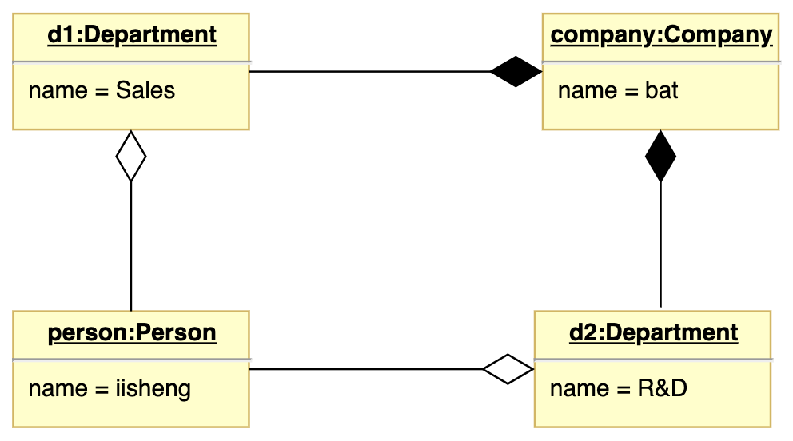
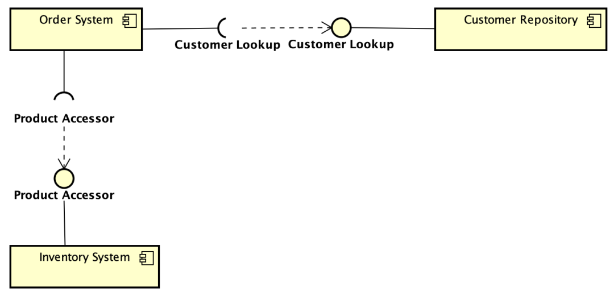
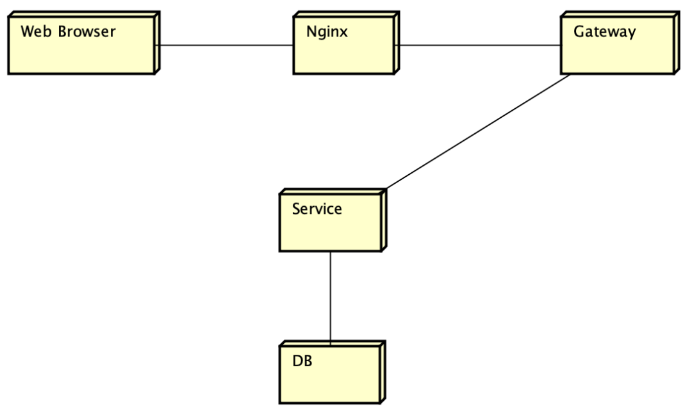
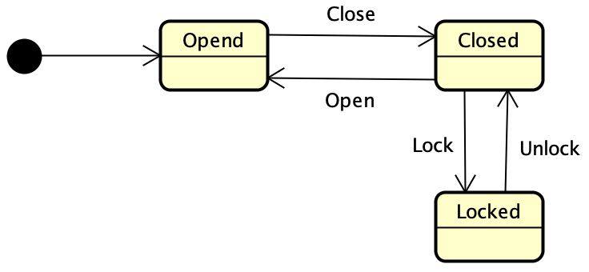
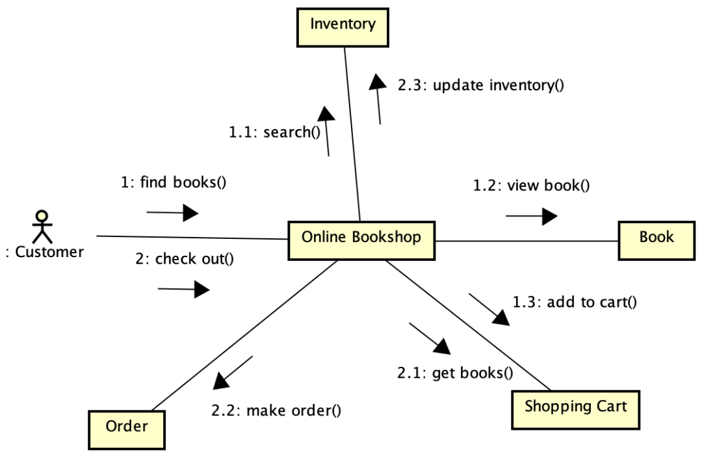

# 案例分析
## 系统规划
### 可行性分析
- 经济可行性：投资/成本收益分析，主要评估项目的建设成本、运行成本和项目建成之后可能的经济收益
- 技术可行性：技术风险分析，评估信息系统需要实现的功能和性能，以及技术能力约束
- 法律可行性：社会可行性，从政策、法律、道德、制度等社会因素评估项目的现实性
- 运营可行性：评估项目实施后的运营效率和可维护性
- 时间可行性：评估项目是否能在预定的时间内完成
- 用户使用可行性：执行可行性，从使用该系统的用户角度评估系统的可行性，包括行政管理和工作制度、使用人员的培训等
### 成本效益计算
- 净现值 = 收入 * 折现系数 - 成本 * 折现系数
- 净现值率 = 净现值 / (成本 * 折现系数)

## 需求工程
### 需求获取
#### 问卷调查法
- 定义：通过结构化问题（选择题、评分题、填空题等）向大规模用户群体快速收集基本需求
- 优点：
  - 能在短时间内从大范围群体中收集数据，成本低，效率高
  - 收集的结果易于统计分析
  - 允许匿名填写，获取的信息更加真实
- 缺点：
  - 缺乏灵活性
#### 用户访谈法
- 定义：通过直接与目标用户进行**一对一**结构化或半结构化对话，**深入了解**其需求和问题
- 优点：
  - 灵活性强，能获取详细信息
  - 适用于复杂或关键用户需求的挖掘
- 缺点：
  - 难以与用户安排时间
  - 面谈信息量大，记录困难
  - 沟通需要技巧，要求系统分析师具有足够的领域知识
#### 现场观察法
- 定义：直接观察**用户实际工作场景**（已有系统）的行为、反应和问题，可获得**第一手**真实资料
- 优点：
  - 获取真实、客观的需求信息
  - 有助于发现用户未明确表达但实际存在的需求
#### 采样
- 定义：从种群中系统地选出有代表性的样本集进行分析，以推断整体需求
- 采样计算：样本数量 = 0.25 * (可信度因子 / 可接受误差)2
- 优点：
  - 利用统计方法，减少数据收集偏差
  - 加快数据收集的过程，提高效率，降低开发成本
- 缺点：
  - 样本规模依赖于期望的可信度和已有的先验知识，很大程度取决于系统分析师的主观因素
#### 联合需求计划JRP
- 定义：通过**高度组织的群体会议**来分析企业内的问题并获取需求的过程，由部门经理、会议主持人、用户、IT人员等共同组成**专题讨论组**来分析问题并定义系统需求
- 优点：
  - 发挥用户和管理人员参与系统开发的积极性，提高开发效率
  - 降低系统需求获取的时间，加速系统的开发周期
  - 通过原型对系统需求进行确认，具有原型化开发方法的优点
#### 情景串联板
- 定义：通过一系列**图片或图示**，展示用户与系统交互的典型场景，帮助识别需求
- 优点：
  - 直观、生动，便于用户理解和反馈
  - 促进团队成员之间的沟通和理解
- 缺点：
  - 花费时间很多，使需求获取的速度大大降低
### 结构化分析方法
自顶向下，逐层分解，把一个大问题分解成若干小问题，每个小问题再分解成更小的问题。逐层分解后的问题都是足够简单、容易解决的。
#### 组成
围绕数据字典为核心，有三个层次的模型，分别是数据模型（E-R图）、功能模型（数据流图）和行为模型（状态转换图）
### 面向对象分析方法
对问题域进行分析和理解，正确认识其中的事物及它们之间的关系，找出描述问题域和系统功能所需的对象，定义它们的属性和职责，以及他们之间的各种联系。
#### 用例模型
无需了解系统内部结构和设计，只关心系统所能提供的服务

- 识别参与者：不仅由人承担，也可以是其他系统和硬件设备，甚至是系统时钟
- 合并需求获得用例：用例命名（动宾结构）
- 细化用例描述
- 调整用例模型
#### 分析模型
分析模型描述系统的基本逻辑结构，展示对象和类如何组成系统，以及它们如何保持通信，实现系统行为

- 定义概念类：名词短句
- 确定类之间的关系：关联、依赖、范化、聚合、组合、实现
- 为类添加职责
- 建立交互图

## 系统设计
- 概要设计：将系统的功能需求分配给软件模块，确定每个模块的功能和调用关系，形成系统结构图
- 详细设计：网络设计、代码设计、输入/输出设计、处理流程设计、数据存储设计、界面设计、安全性和可靠性设计等
### 结构化设计
是一种面向数据流的方法，以SRS需求规格说明书和SA阶段所产生的数据流图和数据字典等文档作为基础，是一个自顶向下、逐步求精和模块化的过程，
将软件设计成由相对独立且具有单一功能的模块组成的结构。
#### 模块划分原则
- 模块大小要适中：过小模块导致系统复杂性增加且调用频繁，过大模块导致系统分解不充分
- 模块的扇入扇出要合理：扇出是指调用下级模块的个数，表示复杂程度，扇入是指直接调用上级模块的个数，表示复用程度
- 深度和宽度要适当
#### 耦合
表示模块之间联系的程度，耦合程度从低到高的排序

- 非直接耦合
- 数据耦合：借助参数传递简单数据
- 标记耦合：借助参数传递数据结构
- 控制耦合：传递包含用于控制模块内部逻辑的信息
- 外部耦合：访问同一全局简单变量
- 公共耦合：访问同一全局数据结构
- 内容耦合：直接访问另一个模块的内部数据
#### 内聚
表示模块内部各成分的联系程度，内聚程度从低到高的排序

- 偶然内聚
- 逻辑内聚：执行逻辑相关任务
- 瞬时内聚/时间内聚：执行同一时间间隔内任务
- 过程内聚：按照特定的次序执行
- 通信内聚：执行相同数据结构的任务
- 顺序内聚：必须顺序执行
- 功能内聚：各个部分协同工作
### 面向对象设计
作为面向对象分析方法的延续，基本思想包括抽象、封装和可扩展性，其中可扩展性通过继承和多态来实现。
#### 设计类
- 实体类：映射需求中的实体对象，保存需要持久化存储的信息，如用户、商品
- 控制类：用于控制用例工作的类，对用例的控制行为继续建模，如结算、备货
- 边界类：封装在用例内外流动的信息或数据流，如浏览器、购物车
#### 面向对象设计原则
- 开闭原则：开放扩展而关闭修改，尽量在不修改原有代码的情况下进行扩展
- 里氏替换原则：软件实体使用的是一个基类对象，一定适用于其子对象，子类型可替换父类型
- 依赖倒置原则：抽象不应该依赖于细节，细节应当依赖于抽象，即高层模块不应该依赖于底层模块的实现，应针对底层模块的接口而非实现编程
- 组合/聚合复用原则：又称复用原则，一个新对象通过组合或聚合关系来使用一些已有的对象，使之成为新对象的一部分，尽量使用组合和聚合，少用继承
- 接口隔离原则：使用多个专门的接口而不是一个单一的总接口，针对不同的客户需求分离接口，避免接口的误用
- 最少知识原则：软件实体应尽可能少地与其他实体发生相互作用
### 微服务
内容：资源、对资源的操作的一组API集合
优势：
- 将巨大的单体式应用分解成多个服务方法解决了复杂性问题，同时保持总体功能不变
- 让每个服务能够独立开发，开发者能够自由选择技术，提供API
- 每个服务器独立部署，加快部署速度
- 每个服务器支持独立扩展，根据服务器的规模来部署满足需求的规模
挑战：
- 并非所有系统都能转成微服务，如数据库的底层操作不推荐服务化
- 部署较以往架构更加复杂，每个服务器需要单独部署
- 由于微服务注重独立性，互相通信只能通过标准接口，可能产生延迟或调用异常
- 数据一致性问题，作为分布式部署的微服务，在保持数据一致性方面比传统模式更加困难
### 设计模式
- 创建型：主要用于创建对象，为设计类实例化新对象提供指南
- 结构型：主要用于处理类或对象的组合，对类如何设计以形成更大的结构提供指南
- 行为型：主要描述类或对象的交互以及职责的分配，对类之间交互以及分配责任的方式提供指南
#### 创建型
- 工厂：定义一个创建对象的接口，由子类决定需要实例化哪一个类
- 抽象工厂；提供一个接口，可以创建一系列相关的对象，无需指定具体的类
- 单例：保证一个类只有一个实例，并提供一个访问它的全局访问点
- 构造器：将复杂类的表示和构造分离，使得相同的构建过程能够得出不同的表示
- 原型：用原型实例指定创建对象的类型，通过拷贝这个原型来创建新对象
#### 结构型
- 外观Decorator：定义一个高层接口，为子系统中的一组接口提供一个一致的外观
- 享元Flyweight：提供支持大量细颗粒度对象共享的方法
- 代理Proxy：为其他对象提供一种代理以控制这个对象的访问
- 组合：将对象组成树型结构以表示整体与部分的层次关系
#### 行为型
- 解释器Interpreter：给定一种语言，定义文法表示，并定义一个解释器，用来根据文法表示来解释语言中的句子（自定义试卷以及试卷对应的评分标准）
- 中介Mediator：用一个中介对象来封装一系列的对象交互（各个构建不允许直接调用）
- 访问者Visitor：数据与操作分离
- 状态State：允许一个对象在其内部状态改变时，改变它的行为（会员升级后享有更多的服务）
- 观察者Observe：定义对象间的一对多的依赖关系，当对象发生变化时，所有依赖于它的对象都能得到通知并自动更新
### 人机交互体验

## UML建模图
- 结构视图：类图、对象图、包图、组件图、部署图
- 行为视图：用例图、状态图、活动图
- 交互视图：序列图、通信图、交互概览图

### 常见图之间的对比
#### 活动图与状态图
- 活动图用于表示**某一用例**的具体动作，状态图用于描述**某个对象**的状态转化
- 活动图涉及多个对象，状态图针对单一对象
#### 互动图与流程图
##### 活动图
- 着重描述系统的行为，描述的是对象活动的顺序关系所遵循的规则
- 可以表示并发活动的场景
- 面向对象
##### 流程图
- 着重描述处理过程，主要的控制结构是顺序、分支和循环，各个处理过程之间有严格的顺序和时间关系
- 只能表示非并发活动场景
- 面向过程
#### 用例图与类图
- 用例图关注系统功能与外部参与者之间的交互，描述“做什么”
- 类图关注系统内部的类和接口，描述“是什么”
#### 序列图与状态图
- 序列图关注对象之间的交互顺序，描述“谁在什么时候调用了什么”
- 状态图关注对象内部的状态变化，描述“在什么条件下从一个状态转换到另一个状态”

### 类图
描述系统中类的静态结构、属性、方法以及类之间的关系
#### 关系
- 关联：两者的结构性关系，一对一或者一对多
- 组合：整体与部分的关系，部分不可以离开整体单独存在，实线实心菱形
- 聚合：整体与部分的关系，部分可以离开整体单独存在，实线空心菱形
- 泛化：继承关系，实线空心三角箭头
- 实现：类与接口的关系，虚线空心三角箭头
- 依赖：使用关系，虚线普通三角箭头
### 对象图
描述系统在**某一特定时间点**，各个对象的具体实例状态及其之间的关系

### 包图
以模块化的方式组织系统中的元素，通过包表示功能或逻辑的分组，体现系统的高层架构和依赖关系
### 组件图
描述系统的物理模块及其接口和依赖关系，展示系统的可执行部分如何组织和交互

### 部署图
描述系统的物理硬件架构及软件组件在这些节点上的分布情况

### 用例图
描述系统功能需求及其外部交互者的静态视图，展示用户能通过系统完成那些目标

- 参与者：表示系统外部的用户或设备
- 用例：功能
- 关系
  - 关联
  - 包含：用例必须调用另一个用例
  - 扩展：用例可选扩展
### 状态图
描述一个对象在其生命周期内所有可能的状态，以及触发状态转换的事件

- 状态（圆角矩形）
- 初状和终态（实心圆）
- 转移（两个状态之间的关系）
- 动作

### 活动图
描述系统的行为以及对象活动的顺序关系所遵循的规则，可以表示并发活动的场景

- 活动：圆角矩形
- 决策节点：分支判断
- 分叉|汇合；表示并行
- 泳道：按角色划分责任

### 序列图
描述对象之间的交互顺序，强调信息传递的时间顺序，展示特定场景下多个对象的动态协作过程

- 对象：顶部矩形
- 生命线：垂直虚线，表示对象存活周期
- 消息：同步、异步、返回
- 激活线：生命线上的垂直小矩形
### 协作图/通信图
强调对象之间的结构关系与消息传递，通过拓扑结构展示交互

### 交互概览图
结合活动图和序列图的特性，用于以高级流程控制的方式组织多个交互场景，展示系统行为的全局视图

## 数据库
### 问题
#### 不满足第三范式
- 问题：会产生函数的传递依赖，造成数据冗余和修改异常
  - 数据冗余是指属性名会被存储多次
  - 修改异常是值修改某个属性，需要修改该属性所有对应的元组属性
- 解决办法：使用触发器在修改时，检查并更新数据的方式来解决数据不一致的问题
#### 数据库并发问题
- 丢失修改：A和B读入同一数据并修改，B的提交结果破坏A的结果，导致A的修改被丢弃
- 读脏数据：将A修改的数据写入磁盘，B读取统一数据，但是A撤销，导致B读取的数据是无效数据
- 不可重复读：A读取数据后，B修改了该数据，但是A使用的还是之前的数据，产生了数据不一致性
- 解决办法：读写锁机制
- 缺点：虽然封锁的方法可以有效防止数据的不一致性，但也会产生死锁问题
### 数据库设计
- 概念设计：在需求分析阶段产生的需求说明书基础上，按照特定的方法将他们抽象为数据模型(概念模型)，E-R图
- 逻辑设计：将概念模型转化为逻辑模型，再对逻辑模型进行优化
- 物理设计：对给定的逻辑模型选取一个最适合应用环境的物理结构，主要是指数据库在物理设备上的存储结构和存取结构
### 反规范化设计
- 增加冗余类：在多个表中具有相同的列，在查询时避免连接操作
- 增加派生类：增加的列可以通过表中其他数据计算产生，减少查询时的计算量，加快查询速度
- 重新组表：如果许多用户需要查看两个表连接出来的结果数据，将两个表重新组成一个表，减少连接
- 表分割
  - 水平分割：根据某些条件将数据放到两个或多个独立的表中，按照记录进行分割
    - 优点：降低查询时需要读的数据和索引的页数，同时降低查询的层数，加快了查询的速度
    - 适用场景：表的数据量大、表中的数据具有独立性
  - 垂直分割：把主码和一些列放在一个表中，把主码和另外的列放在另外的表中
    - 优点：行数据变小，从而使一个数据块可以存储更多的数据、达到最大化利用Cache的目的
### 物理数据分区
- 水平分区
  - 范围分区
    - 优点：将表存储在多个表空间中，各分区维护各自的本地索引；可对单个表进行备份、归档，利于维护；实现容易，方便对表的分区进行添加、删除、拆分和合并操作
    - 缺点：数据分布不均匀
  - 哈希分区
  - 列表分区
- 垂直分区

## 项目管理
### 进度管理
#### 进度时间计算
考虑到任务之间的并行关系，工作量计算：人天
#### 进度调整
- 关键活动调整：任意活动时间的调整都会对整个项目的工期产生影响
- 非关键活动调整：必要时可以对该活动做适当调整，但不能超出总时差，且每次调整均需进行参数计算，以观察产生的影响
- 增减工作项：增加工作项，只对原遗漏或不具体的逻辑关系进行补充；减少工作项，只对提前完成或不应设置的的工作项进行消除
- 资源调整：若资源供应发生异常，进行资源调整
